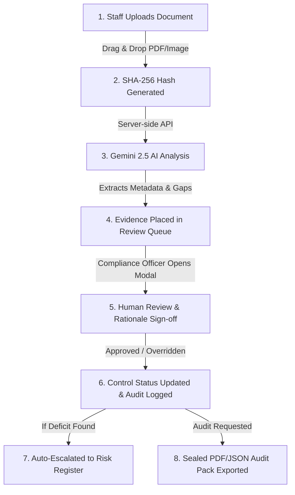

# PawCare-Compliance AI: Comprehensive Office Presentation Guide & Application Documentation

> **Target Audience:** Office Colleagues, Veterinary Practice Managers, Compliance Officers, Executive Reviewers, and Engineering Teams.  
> **Application Name:** PawCare-Compliance AI (Veterinary Care Compliance Evidence & Risk Control Workspace)  
> **Brand Symbol:** Puppy Paws Foot Trail (`PuppyPawLogo`)

---

## 📋 Executive Summary

**PawCare-Compliance AI** is an enterprise-grade, multi-tenant compliance management platform designed specifically for veterinary hospitals and emergency clinics. It converts manual, error-prone regulatory recordkeeping into an automated, AI-assisted, and cryptographically verifiable operational engine.

By bridging daily clinical documentation (surgical consents, controlled substance logs, rabies certificates, lab reports, and billing invoices) with strict regulatory standards (**DEA Schedule II-V, AAHA, State Pharmacy Boards, OSHA, and VCPR mandates**), PawCare-Compliance AI eliminates audit panic and ensures 100% regulatory defensibility.

---

## 🎯 Section 1: The Problem Statement

### What Challenges Do Veterinary Hospitals Face Today?

1. **Manual & Fragmented Recordkeeping:**
   - Veterinary staff record anesthesia logs, surgical consents, and drug waste on paper forms or disparate software systems.
   - Finding proof of compliance during an unannounced inspection takes hours or days.

2. **Severe Regulatory & Legal Exposure:**
   - **DEA (Drug Enforcement Administration):** Missing witness signatures on controlled substance waste (e.g., Ketamine, Midazolam, Fentanyl) leads to hefty fines ($15,000+ per violation) or DEA license revocation.
   - **AAHA (American Animal Hospital Association):** Failure to produce documented owner surgical and CPR consent jeopardizes hospital accreditation.
   - **State Pharmacy Boards & VCPR:** Dispensing controlled medications without a valid, documented Veterinary-Client-Patient Relationship (established within 12 months) is illegal.

3. **High Human Error & "Silent Deficits":**
   - Under busy emergency room conditions, staff forget co-signatures, illegible DVM license numbers occur, or itemized billing invoices mismatch drug safe balances.

---

## 💡 Section 2: The Solution — How PawCare-Compliance AI Solves It

PawCare-Compliance AI transforms compliance management using four core pillars:

```
┌─────────────────────────────────────────────────────────────────────────┐
│                      PAWCARE-COMPLIANCE AI PILLARS                      │
├──────────────────┬──────────────────┬──────────────────┬────────────────┤
│ 1. AI Evidence   │ 2. Cryptographic │ 3. Human-in-the- │ 4. 1-Click     │
│    Ingestion     │    SHA-256 Hash  │    Loop Review   │    Audit Packs │
├──────────────────┴──────────────────┴──────────────────┴────────────────┤
│ Automated text   │ Immutable proof  │ AI NEVER auto-   │ Sealed JSON &  │
│ extraction via   │ preventing file  │ certifies.       │ PDF regulatory │
│ Gemini 2.5 AI.   │ tampering.       │ Human sign-off   │ certificates   │
│                  │                  │ is mandatory.    │ for inspectors.│
└─────────────────────────────────────────────────────────────────────────┘
```

### Core Value Proposition:
- **Zero Auto-Certification (Human-in-the-Loop Protocol):** AI acts purely as a Decision Support Assistant. AI recommendations *never* update a control to "COMPLIANT" without explicit, authenticated human reviewer sign-off.
- **Tamper-Proof Lineage:** Every uploaded document generates a unique **SHA-256 cryptographic hash digest** upon intake.
- **Instant Audit Readiness:** Generates cryptographically sealed PDF and JSON audit bundles with a single click.

---

## 🔄 Section 3: Step-by-Step Workflow (How the App Works in Practice)



### Walkthrough of a Real-World Scenario:
1. **Intake:** A Veterinary Technician completes a Ketamine drug disposal log and uploads the scan to `/evidence-mapping`.
2. **AI Classification:** The backend executes Google Gemini 2.5 Pro to parse the document, extract drug names, patient names, and check for required signatures.
3. **Gap Detection:** Gemini detects that the mandatory **witness co-signature for 0.2 mL waste disposal is missing**, assigning a confidence score of `0.58`.
4. **Human Sign-Off:** The Compliance Officer reviews the extracted text, sees the AI grounding explanation, and submits an explicit **Override / Reject** decision with a mandatory rationale.
5. **Risk Escalation:** The platform automatically logs an immutable audit trail entry and creates a high-priority action item in the `/risks-issues` register with a target due date.
6. **Audit Export:** During an inspection, the hospital manager clicks **"Export Sealed Audit Pack"** on `/audit-packs` to download an official, cryptographically signed PDF attestation certificate.

---

## 🖥️ Section 4: Deep Dive into the 12 Application Modules

| # | Route | Module Name | Primary Purpose in Presentation |
|---|---|---|---|
| 1 | `/login` | **Secure Auth & Role Selector** | Role-aware login with **1-click evaluation roles** (`COMPLIANCE_OFFICER`, `CONTROL_OWNER`, `AUDITOR`, `EXECUTIVE_REVIEWER`, `CLINICAL_STAFF`). |
| 2 | `/dashboard` | **Executive Compliance Command** | High-level dashboard displaying overall compliance score %, active residual risks, domain breakdowns, and recent audit logs. |
| 3 | `/controls` | **Control Library & Policy Mapping** | Central repository mapping regulatory requirements (DEA, AAHA, OSHA, VCPR) to hospital policies and controls. |
| 4 | `/evidence-mapping` | **AI Evidence Classification Engine** | Drag-and-drop file upload zone displaying real-time SHA-256 digests, Gemini AI confidence scores, and extracted grounding explanations. |
| 5 | `/control-gaps` | **Control Gap Analysis** | Matrix prioritizing missing, stale, contradictory, or unreviewed evidence with algorithmic risk scores. |
| 6 | `/risks-issues` | **Risk Register & Remediation** | Issue tracking system for control deficits with target due dates and assigned owners. |
| 7 | `/decision-history` | **Immutable Audit History** | Unalterable audit trail capturing actor ID, timestamp, before/after control states, and mandatory override rationales. |
| 8 | `/audit-packs` | **Audit Pack & Lineage Exporter** | One-click compilation of controls and evidence hashes into downloadable JSON and official PDF attestation bundles. |
| 9 | `/reports-analytics` | **AI Observability Dashboard** | Recharts visual analytics tracking Gemini AI latency (ms), confidence distributions, override rates, and model drift. |
| 10 | `/notifications` | **Alert Center & Preference Matrix** | Real-time notifications for overdue control tests, expired VCPRs, and low-confidence document extractions. |
| 11 | `/users-roles` | **User Management & RBAC Matrix** | User table and multi-role permission capability matrix. |
| 12 | `/audit-logs-settings` | **Master Data & Settings** | Facility profiles, retention policy parameters (months), and AI confidence thresholds. |

---

## 🛠️ Section 5: Technical Architecture (For Technical & IT Colleagues)

- **Frontend:** Built with React 18, Vite, Tailwind CSS, Lucide React icons, and Recharts.
- **Backend:** Node.js (v20+), Express.js, TypeScript (ESM), Multer, pdf-parse, and PDFKit.
- **Database:** Supabase Cloud PostgreSQL with Row Level Security (RLS) policies enforcing multi-tenant isolation.
- **AI Integration:** `@google/genai` SDK executing server-side calls to `gemini-2.5-pro` with Structured Output schemas (`responseSchema`).
- **Cryptographic Hashing:** Node.js `crypto` library computing SHA-256 digests for tamper-proof lineage.

---

## 🗣️ Section 6: Recommended Office Presentation Script (Slide-by-Slide)

### **Slide 1: Introduction**
> *"Good morning team. Today I am excited to present **PawCare-Compliance AI**, our new enterprise-grade Veterinary Care Compliance & Risk Control Workspace."*

### **Slide 2: The Problem**
> *"In veterinary medicine, compliance is non-negotiable. DEA controlled substance logs, AAHA surgical consents, Rabies vaccination records, and VCPR license checks are currently managed manually across paper logs and separate tools. A single missing witness signature on a Ketamine disposal can result in severe fines or license suspension."*

### **Slide 3: The Solution**
> *"PawCare-Compliance AI automates this entire pipeline. Staff simply upload clinical documents. Our server-side Gemini 2.5 AI parses the text, extracts key compliance metadata, computes an unalterable SHA-256 cryptographic hash, and flags any compliance gaps."*

### **Slide 4: Human-in-the-Loop Protocol**
> *"Crucially, AI does NOT make final decisions alone. The platform enforces a strict Human-in-the-Loop protocol. A Compliance Officer or Reviewer must review the AI's findings, enter a mandatory justification, and sign off before any control is certified as COMPLIANT."*

### **Slide 5: Audit Readiness & Demo**
> *"When inspectors from the DEA, AAHA, or State Pharmacy Board arrive, instead of searching through physical folders, we click 'Export Audit Pack' on `/audit-packs` to instantly generate an official, cryptographically sealed PDF attestation certificate. Let's walk through a live demonstration of the 12 application modules."*
